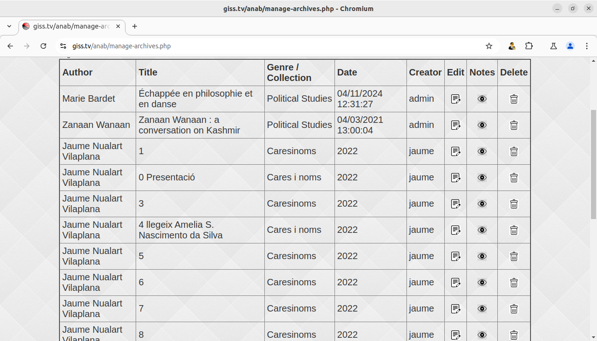
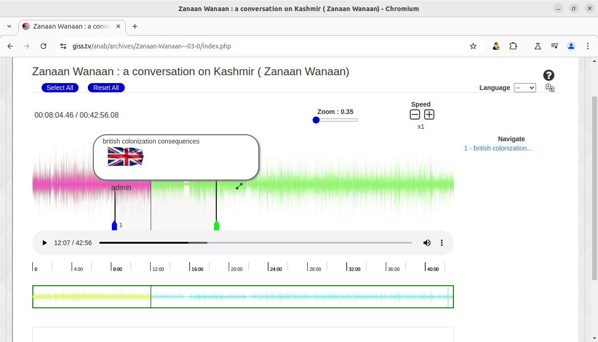
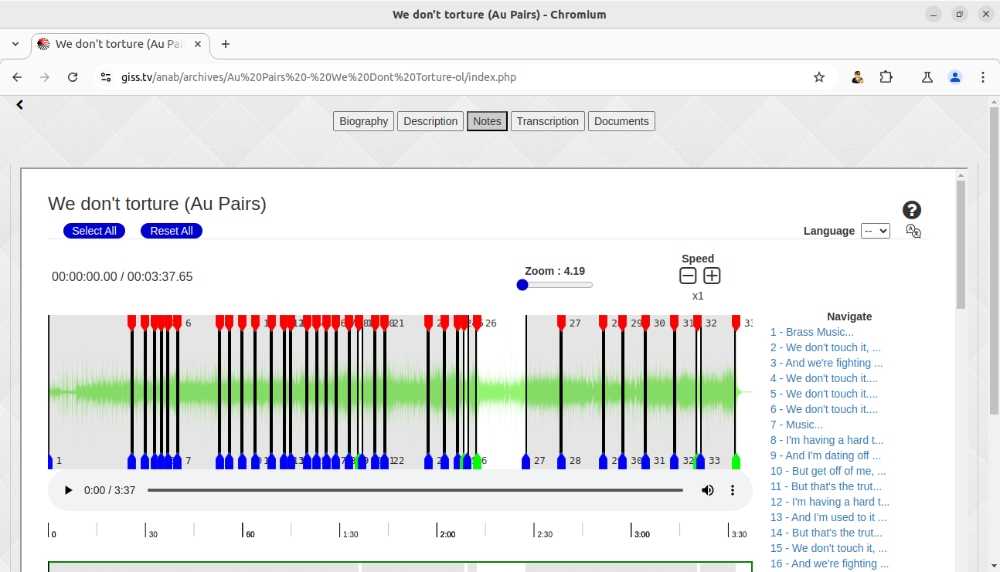
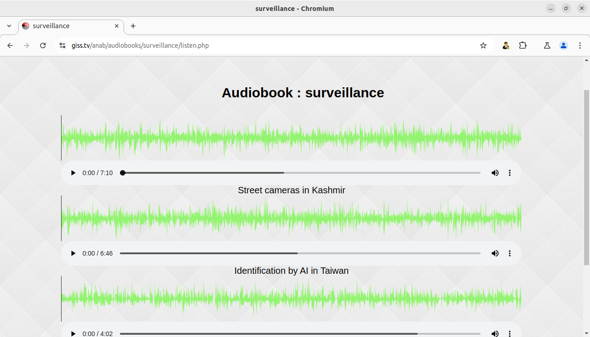
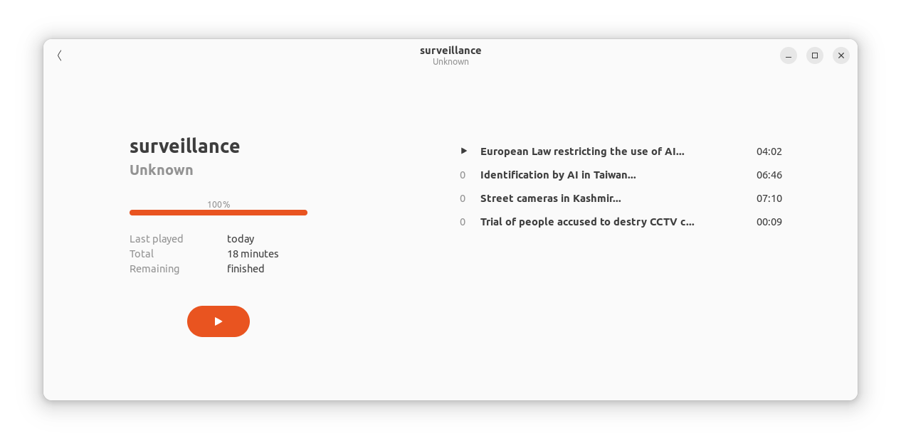

A.N.a.B. is a cool toolkit ( coolkit ) to handle audio archive in a collaborative manner
for a group of people to share audio documents, whatever they are,
from conferences to music remixes to archive of social movements...

Let us put it more clearly by having a tour of its features
and you will get a clearer vision of what it can do for you :

 * <b>a smart audio archive for your documents and music :</b>

   - you can import all your audio documents from audio & video files with a simple URL.
   - the system will extract a waveform from your files and only store this on your server.
   - it will not store the audio file or audio extracted from a video, but only the waveform.
   - the ratio of waveform to audio file is about 1/10.
   - it will use the most common meta-data to index your files, sort and search them  :

 * <b>sharing notes and comments on audio files</b>

   - in the notes screen, you can select parts of the audio
     and put your own comments on files with links to other ressources on the web.
   - the notes you create on files can be exported as a subtitle file in the language 
     or your choice, when the notes start with a language code like en:, ar:, es:, ...
   - for each note created, you can translate them to other language using
     the translate icon on each note or the global translate icon that
     will translate all your document :
     

 * <b>AI transcription of documents</b>

   - if the file has an intelligible content, like a conference or a song with clear lyrics,
     you can use the Whisper icon :
     
     to call the OpenAI Whisper that will freeze your document and extract
     every single phrase in your file and cut the files in section accordingly!
   - this process requires lots of machine ressources, so you should not abuse of it.
   - OpenAI Whisper, according to our experience, has a 70-75 % of accuracy,
     so you will surely have to rework all the transcription by hand,
     see the example below where it extracts phrases and transcript 
     'We don't torture' to 'We don't touch it', wrongly of course,
     but the sections created are correct :
  

 * <b>Creating Audio Books from sections selected</b>

   - once you have created notes on whatever audio files in your collection,
     you can add them to Audio Books that you can create with the Audio Book icon :
     
   - each of your notes becomes a chapter in the audio book.
   - when a book is filled and ready, it can be exported to a .zip
     file containing the book in Daisy 2.0 format.
   - these audio books can be seen as a tool to confront points of view
     for a specific subject of philosophy ot politics, the initial goal
     of this project created with the 'Political Studies' group.
     http://political-studies.net
   - this is a suggestion of use, but you can also create mixes of music,
     or story telling by extracting parts of 'relatos', narratives, experiences, ...
     or reports of demonstration ...
   - here, we create a book about surveillance in different countries :

These are the main features but we think of extending it to other uses,
if some requests are communicated to : chevil@giss.tv

A showcase video of actual features is available here :
http://giss.tv/~chevil/Videos/anab.webm

   - concept and programming : chevil@giss.tv
   - initial concept & design : beatrice.rettig@gmail.com
   - testing & advices : jaume@nualart.cat

LICENSE <b>!important</b>

This piece of software is published under the terms
of <b>HIPPOCRATIC</b> license that fosters the ethical 
use of tools in this age of digital surveillance :

https://firstdonoharm.dev/ 

so don't use it for an archive of <b>FAKE NEWS</b>
or <b>CONSPIRATION THEORIES!</b>
